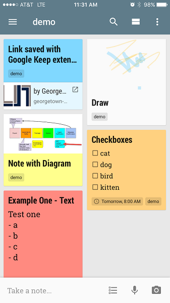
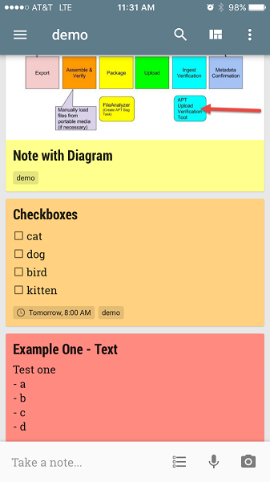
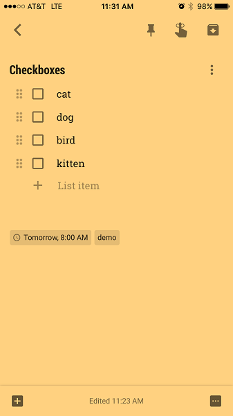
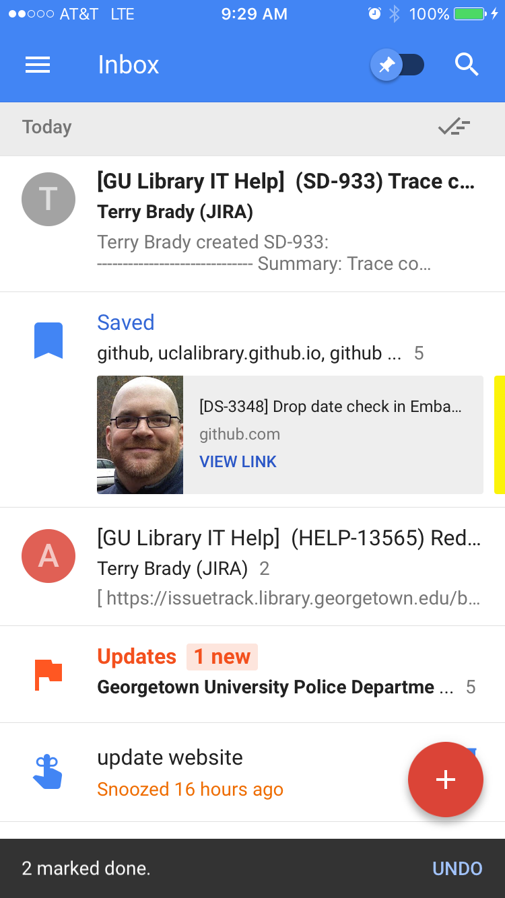
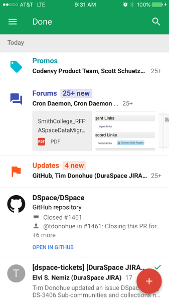
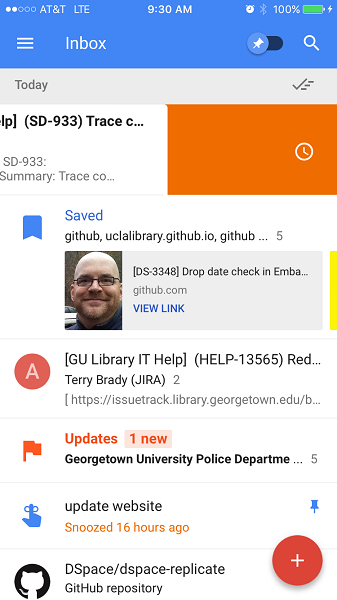
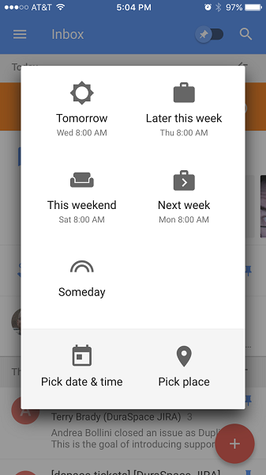
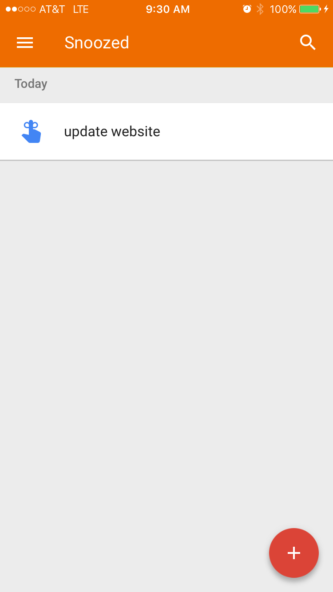
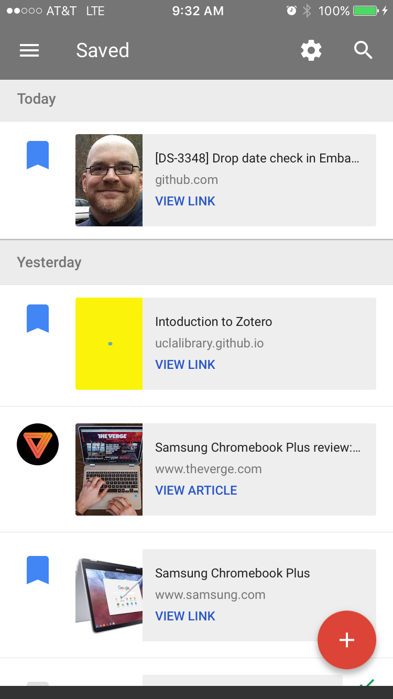

#HSLIDE
### Using Google Keep and Google Inbox (Draft)

#HSLIDE
### Google Keep - Note taking tool
Like Microsoft OneNote
* Web version
* Mobile version
* Chrome extension

#VSLIDE
### Google Keep Features
* Note Sharing
* Drawing
* Rich links
* Reminders

#VSLIDE
### Google Keep demo
* <a href="http://keep.google.com" target="_blank">keep.google.com</a>

#VSLIDE
### Google Keep Mobile

#VSLIDE

#VSLIDE

#VSLIDE

#HSLIDE
### Google Inbox - get to inbox zero
* Features
 * mark done - sweep
 * grouping
 * remind me
 * pin
* Web version
* Mobile version
* Chrome extension - save to inbox
* Reminder

#VSLIDE
### What doesn't work
- contacts are hard to access
- cant see mail header
- starred items are not immediately accessible
- mark spam/phishing options are limited

#VSLIDE

#VSLIDE

#VSLIDE

#VSLIDE

#VSLIDE

#VSLIDE

