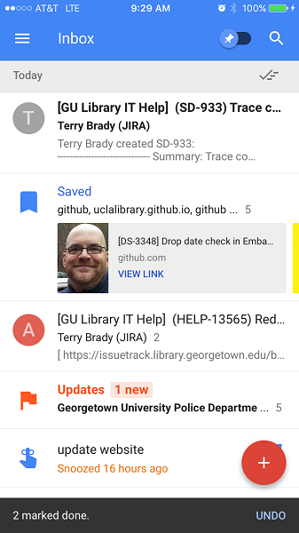
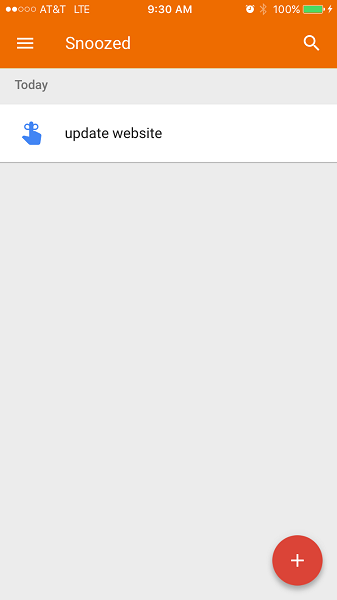

#HSLIDE
### Using Google Keep and Google Inbox (Draft)

#HSLIDE
### Google Keep - Note taking tool
Like Microsoft OneNote
* Web version
* Mobile version
* Chrome extension

#VSLIDE
### Google Keep Features
* Note Sharing
* Drawing
* Rich links
* Reminders

#VSLIDE
### Google Keep demo
* <a href="http://keep.google.com" target='_blank'>keep.google.com</a>

#VSLIDE
### Google Keep Mobile

#VSLIDE

#VSLIDE

#VSLIDE

#HSLIDE
### Google Inbox
Feature rich mail client
* web client
* mobile client
* chrome extension to save research notes to inbox

Works best with Inbox Zero

#VSLIDE
### Google Inbox Features
* grouping
 * trips are especially nice
* "sweep items" into archive - Inbox 0
* swipe left/right to archive
* automated Reminders
* saved items

#VSLIDE
### Google Keep demo
* <a href="http://inbox.google.com" target='_blank'>inbox.google.com</a>

#VSLIDE
### What doesn't work well
- contacts are hard to access from an e-mail
- cant see mail header
- starred items are not immediately accessible
- mark spam/phishing options are limited

#VSLIDE
### You can still use Gmail

#VSLIDE
### Google Inbox Mobile

#VSLIDE

#VSLIDE

#VSLIDE

#VSLIDE

#VSLIDE

#VSLIDE

